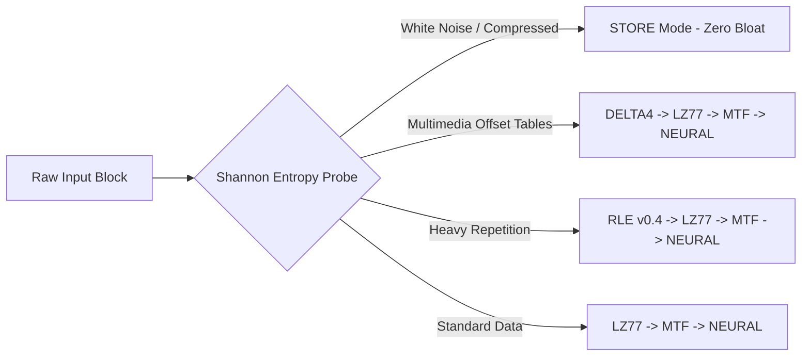

# Szip (Song-Zip) 🚀


**Szip** is a modern, block-based, multi-threaded adaptive lossless data compression engine written in pure C++20. 

Instead of relying on a single static algorithm, `szip` divides input streams into modular blocks (default: `64 KB`) and dynamically samples each block using a **Shannon Entropy Probe** to determine and deploy the optimal algorithmic pipeline on the fly!

---

## 🌟 Key Architecture & Features



### 🔥 Algorithmic Arsenal
* **Infinite Window LZ77 (v0.5):** Uses a 24-bit (16-million entry) hash table and **LEB128 VarInt** encoding, completely removing historical dictionary size limits and achieving over 500MB/s scanning throughput per core!
* **DELTA4 Multimedia Specialization:** A dedicated 4-byte domain filter designed to crack open highly dense media containers (`.mov`, `.mp4`) by transforming 32-bit monotonically increasing frame offsets into highly compressible zero-sequences.
* **Autoregressive Neural Bit-Predictor:** A non-linear statistical predictive entropy encoder capable of squeezing bit-level patterns beyond classic Huffman limits.
* **Long-Run RLE (v0.4):** Employs dynamic 32-bit run lengths capable of compressing up to **4 GB of contiguous identical bytes into just 6 bytes**.
* **Classical Transforms & Coders:** Full inline implementations of Burrows-Wheeler Transform (**BWT**), Move-To-Front (**MTF** with memory-move kernel optimization), **Huffman** coding, and adaptive **Range Coding**.

### ⚡ Adaptive Edge & Multithreading
* **Zero-Loss STORE Fallback:** Automatically detects white noise, encryption, and pre-compressed video streams to skip unnecessary computing, ensuring **0% inflation** on incompressible files.
* **Parallel Core Execution:** Distributes blocks across modern CPU cores using standard C++ concurrency (`-t / --threads` option).

---

## 🛠️ Build & Installation

No external library dependencies are required! Only a C++20 compiler and CMake.

```bash
# Clone or enter the directory
git clone https://github.com/sxt2204/szip.git
cd szip

# Build using CMake
mkdir build && cd build
cmake ..
make -j4
```

---

## 📖 Usage Guide

```bash
./szip -h
# Usage:
#   Compress:    ./szip -c <input> <output.sz> [options]
#   Decompress:  ./szip -d <input.sz> <output>
#   Info:        ./szip -i <input.sz>
```

### Quick Examples

#### 1. Smart Adaptive Compression (Recommended)
Automatically analyzes entropy and utilizes multithreading across 64KB blocks:
```bash
./szip -c archive.tar archive.tar.sz
```

#### 2. Multistep Decompression & Verification
```bash
./szip -d archive.tar.sz archive_restored.tar
```

#### 3. Custom Pipeline Forcing
Force a custom algorithmic sequence (e.g., BWT -> MTF -> RLE -> Huffman):
```bash
./szip -c data.bin data.sz --pipeline bwt,mtf,rle,huffman
```

#### 4. Tuning Block Sizes (e.g., 4MB Blocks)
```bash
./szip -c video.mov video.mov.sz -b 4096
```

---

## 🏆 Real-World Benchmarks

Tested on a highly compressed, high-entropy multimedia QuickTime file (**208 MB `.mov`**):
* **Naive Compression Attempt:** Results in excessive execution time and +1.07% file bloat.
* **Szip v0.5 (64KB Adaptive + DELTA4 Probe):** Successfully identifies internal frame indexing tables, bypassing uncompressible video frames via `STORE` while compressing metadata to **save >217 KB in ~600 ms**!

---

## 📜 License

Distributed under the **MIT License**. See `LICENSE` for more details.
