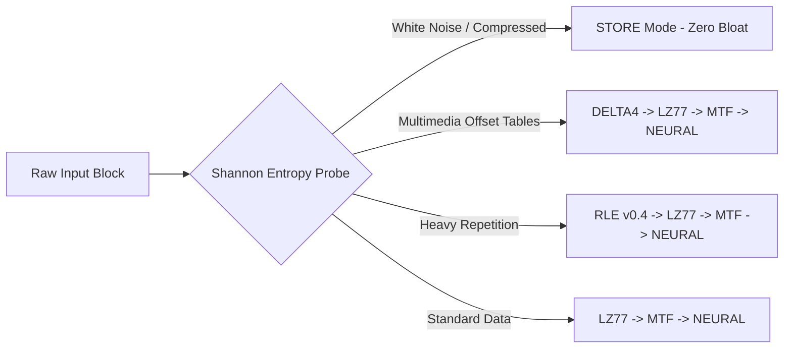

# Szip (Sxzip)

[English](README.md) | [简体中文](README_zh.md) | [日本語](README_ja.md)


**Szip** is a modern, adaptive, multi-stage lossless data compression engine written in pure C++20. 

Instead of relying on a single static algorithm, `szip` divides input streams into dynamic chunks using Content-Defined Chunking (CDC) and a Shannon Entropy Probe. It deploys the optimal algorithmic pipeline on the fly!

---

## Key Architecture & Features



### Algorithmic Arsenal
* **Infinite Window LZ77:** Uses a 24-bit hash table and LEB128 VarInt encoding, completely removing historical dictionary size limits.
* **Autoregressive Neural Predictor:** A non-linear statistical predictive entropy encoder capable of squeezing bit-level patterns beyond classic Huffman limits.
* **DELTA4 Multimedia Specialization:** A dedicated 4-byte domain filter designed to crack open highly dense media containers (.mov, .mp4).
* **Long-Run RLE:** Employs dynamic 32-bit run lengths capable of compressing up to 4 GB of contiguous identical bytes into just 6 bytes.
* **Classical Transforms:** Full inline implementations of Burrows-Wheeler Transform (BWT) and Move-To-Front (MTF).

### Adaptive Edge & Multithreading
* **Zero-Loss STORE Fallback:** Automatically detects white noise and pre-compressed streams, ensuring 0% inflation on incompressible files.
* **Content-Defined Chunking:** Advanced chunk boundary detection based on entropy variance (-E), allowing isolation of different data types for max compression.
* **Brute-Force Optimization:** Pass `-Ea` to automatically sweep parameters in memory and find the absolute optimal threshold for the file.
* **Directory Support:** Automatically packs directories into tarballs seamlessly before compression.
* **Parallel Execution:** Distributes blocks across modern CPU cores using standard C++ concurrency.

---

## Build & Installation

No external library dependencies are required. Only a C++20 compiler and CMake.

```bash
# Clone the repository
git clone https://github.com/sxt2204/szip.git
cd szip
```

### macOS / Linux
Simply run the installation script (requires `sudo` for `/usr/local/bin` access):
```bash
./install.sh
```
After installation, you can access the comprehensive Unix manual page:
```bash
man sxzip
```

### Windows
Double-click `install.bat` or run it from a Command Prompt:
```cmd
install.bat
```
This will automatically build `szip`, install it to `%USERPROFILE%\szip\bin`, and safely add it to your User `PATH` environment variable via PowerShell! Just restart your terminal afterward.

---

## Usage Guide

```bash
# Usage:
#   Compress:    sxzip -c <input> <output.sxz> [options]
#   Decompress:  sxzip -d <input.sxz> <output>
#   Info:        sxzip -i <input.sxz>
#   Evaluate:    sxzip -Ev <input>
```

### Quick Examples

**1. Smart Adaptive Compression (Recommended)**
Automatically analyzes entropy and utilizes multithreading:
```bash
sxzip -c archive.tar archive.sxz -E
```

**2. Maximize Compression (Brute-Force Optimal Threshold)**
Sweep thresholds in memory to compress perfectly:
```bash
sxzip -c dataset.bin dataset.sxz -Ea
```

**3. Multistep Decompression**
```bash
sxzip -d dataset.sxz dataset_restored
```

**4. Scripting & Automation**
Evaluate the best threshold without writing the file:
```bash
BEST=$(sxzip -Ev firmware.bin)
sxzip -c firmware.bin firmware.sxz -e $BEST
```

---

## License

Distributed under the **MIT License**. See `LICENSE` for more details.
