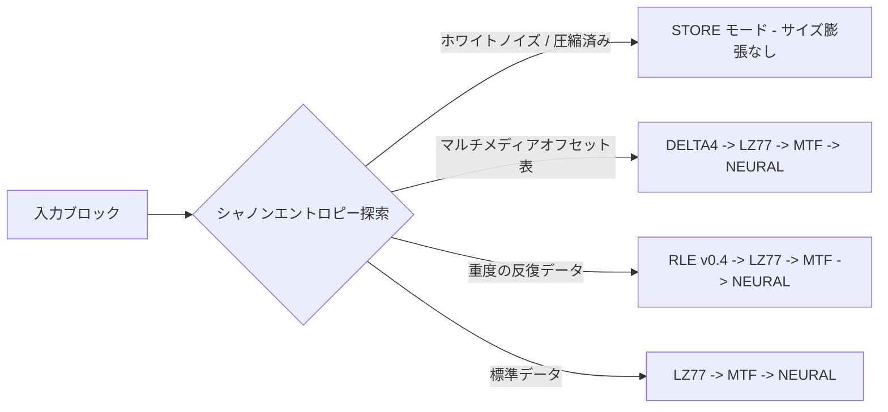

# Sxzip (Sxzip)

[English](README.md) | [简体中文](README_zh.md) | [日本語](README_ja.md)


**Sxzip** は、純粋な C++20 で書かれた、最新の適応型マルチステージ可逆データ圧縮エンジンです。

単一の静的アルゴリズムに依存するのではなく、`sxzip` は Content-Defined Chunking (CDC) とシャノンエントロピー探索を使用して入力ストリームを動的なチャンクに分割し、オンザフライで最適なアルゴリズムパイプラインを展開します！

---

## 主なアーキテクチャと機能



### アルゴリズムアーセナル
* **無限ウィンドウ LZ77:** 24ビットハッシュテーブルと LEB128 VarInt エンコーディングを使用し、従来の辞書サイズ制限を完全に排除します。
* **自己回帰ニューラル予測器:** 古典的な Huffman 限界を超えるビットレベルのパターンを圧縮できる非線形統計的予測エントロピーエンコーダ。
* **DELTA4 マルチメディア特化:** 高密度メディアコンテナ (.mov、.mp4) を解読するために設計された専用の4バイトドメインフィルタ。
* **ロングラン RLE:** 最大4GBの連続する同一バイトをわずか6バイトに圧縮できる動的32ビットランレングスを採用。
* **古典的変換:** Burrows-Wheeler 変換 (BWT) と Move-To-Front (MTF) の完全なインライン実装。

### 適応性とマルチスレッド
* **ゼロロス STORE フォールバック:** ホワイトノイズや圧縮済みのストリームを自動的に検出し、非圧縮ファイルのサイズ膨張を0%に保証します。
* **コンテンツベースのチャンク分割 (CDC):** エントロピー分散 (-E) に基づく高度なチャンク境界検出により、データ型を分離して圧縮を最大化します。
* **ブルートフォース最適化:** `-Ea` を渡すと、メモリ内のパラメータを自動的にスイープし、ファイルの絶対的な最適しきい値を見つけます。
* **ディレクトリのサポート:** 圧縮前にディレクトリを自動的に tarball にシームレスにパッケージ化します。
* **並列実行:** 標準の C++ 並行処理を使用して、最新の CPU コア全体にブロックを分散させます。

---

## ビルドとインストール

外部ライブラリへの依存はありません。必要なのは C++20 コンパイラと CMake のみです。

```bash
# リポジトリをクローン
git clone https://github.com/sxt2204/sxzip.git
cd sxzip
```

### macOS / Linux
自動インストールスクリプトを実行するだけです（`/usr/local/bin` へのアクセスには `sudo` が必要です）：
```bash
./install.sh
```
インストール後、包括的な Unix マニュアルページにアクセスできます：
```bash
man sxzip
```

### Windows
`install.bat` をダブルクリックするか、コマンドプロンプトから実行します：
```cmd
install.bat
```
これにより、自動的に `sxzip` がビルドされ、`%USERPROFILE%\sxzip\bin` にインストールされ、PowerShell を介して安全にユーザーの環境変数 `PATH` に追加されます。完了後、ターミナルを再起動するだけで使用できます。

---

## 使い方ガイド

```bash
# 使用法:
#   圧縮:    sxzip -c <入力> <出力.sxz> [オプション]
#   解凍:    sxzip -d <入力.sxz> <出力>
#   情報:    sxzip -i <入力.sxz>
#   評価:    sxzip -Ev <入力>
```

### クイック例

**1. スマート適応圧縮 (推奨)**
エントロピーを自動分析し、マルチスレッドを利用します：
```bash
sxzip -c archive.tar archive.sxz -E
```

**2. 圧縮の最大化 (ブルートフォース最適しきい値)**
メモリ内のしきい値をスイープして完全に圧縮します：
```bash
sxzip -c dataset.bin dataset.sxz -Ea
```

**3. 解凍**
```bash
sxzip -d dataset.sxz dataset_restored
```

**4. スクリプトと自動化**
ファイルを書き込まずに最適なしきい値を評価します：
```bash
BEST=$(sxzip -Ev firmware.bin)
sxzip -c firmware.bin firmware.sxz -e $BEST
```

---

## ライセンス

**MIT License** の下で配布されています。詳細については `LICENSE` を参照してください。
