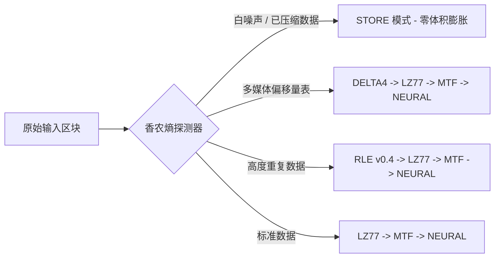

# Sxzip (Sxzip)

[English](README.md) | [简体中文](README_zh.md) | [日本語](README_ja.md)


**Sxzip** 是一个使用纯 C++20 编写的现代化、自适应、多阶无损数据压缩引擎。

`sxzip` 不依赖于单一的静态算法，而是通过基于香农熵探测器的**基于内容分块 (CDC)** 技术，将输入流划分为动态大小的区块，并实时为每个区块部署最优的算法流水线！

---

## 核心架构与功能



### 算法武器库
* **无限窗口 LZ77:** 采用 24-bit 哈希表与 LEB128 变长整数编码，彻底打破了传统字典大小的限制。
* **自回归神经网络预测器:** 一种非线性的统计预测熵编码器，能够突破经典 Huffman 极限，榨干位级别的重复模式。
* **DELTA4 多媒体特化引擎:** 专为解构高密度媒体容器（如 .mov, .mp4）而设计的 4 字节域过滤器。
* **长距离 RLE:** 采用动态 32 位游程长度，能将高达 4GB 的连续重复字节压缩至区区 6 个字节。
* **经典变换:** 内置完整的 BWT (Burrows-Wheeler Transform) 和 MTF (Move-To-Front) 内存优化实现。

### 自适应与并发优势
* **零损耗 STORE 降级:** 自动检测白噪声和预压缩流，确保无法压缩的文件体积 **0% 膨胀**。
* **基于内容分块 (CDC):** 基于局部熵方差 (-E) 自动寻找切割边界，隔离不同类型的数据以实现最大压缩率。
* **全局最优暴力破解:** 使用 `-Ea` 参数，在内存中自动扫掠参数以寻找文件的绝对最佳分块阈值。
* **目录打包支持:** 在压缩前会自动识别并无缝将其打包为 tarball。
* **并行执行:** 利用现代 C++ 并发库，将多个区块分配到所有 CPU 核心上并行压缩。

---

## 构建与安装

不需要任何外部库依赖！只需要 C++20 编译器和 CMake。

```bash
# 克隆仓库
git clone https://github.com/sxt2204/sxzip.git
cd sxzip
```

### macOS / Linux
直接运行全自动安装脚本（需要 `sudo` 权限以复制到 `/usr/local/bin`）：
```bash
./install.sh
```
安装完成后，你可以通过标准的 Unix 手册查阅高级文档：
```bash
man sxzip
```

### Windows
双击 `install.bat`，或者在命令提示符下运行：
```cmd
install.bat
```
它将自动构建 `sxzip`，将其安装到 `%USERPROFILE%\sxzip\bin`，并使用 PowerShell **安全地将其自动添加到当前用户的环境变量 `PATH` 中**！完成后，只需重启你的终端即可使用。

---

## 使用指南

```bash
# 语法:
#   压缩:    sxzip -c <输入> <输出.sxz> [选项]
#   解压:    sxzip -d <输入.sxz> <输出>
#   信息:    sxzip -i <输入.sxz>
#   估算:    sxzip -Ev <输入>
```

### 快速上手示例

**1. 智能自适应压缩 (推荐)**
全自动分析数据熵值，并启用多线程自适应区块压缩：
```bash
sxzip -c archive.tar archive.sxz -E
```

**2. 极限压缩 (暴力破解最优阈值)**
在内存中扫掠参数，达到理论最高压缩比：
```bash
sxzip -c dataset.bin dataset.sxz -Ea
```

**3. 解压缩**
```bash
sxzip -d dataset.sxz dataset_restored
```

**4. 自动化脚本支持**
在不写入文件的情况下估算最佳阈值：
```bash
BEST=$(sxzip -Ev firmware.bin)
sxzip -c firmware.bin firmware.sxz -e $BEST
```

---

## 许可证

本项目采用 **MIT License** 授权。详情请参阅 `LICENSE` 文件。
